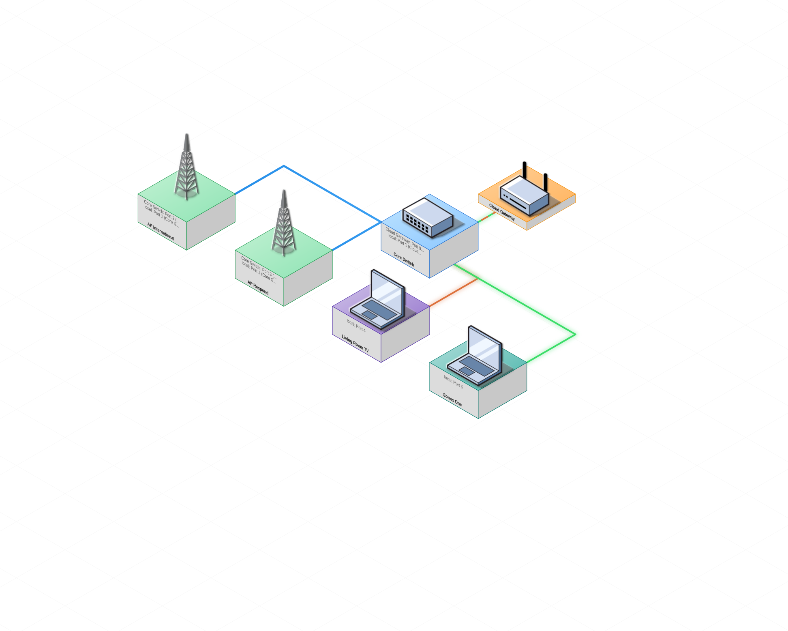
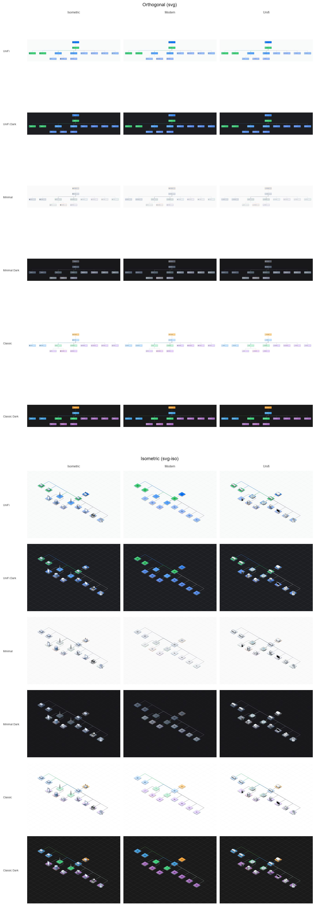
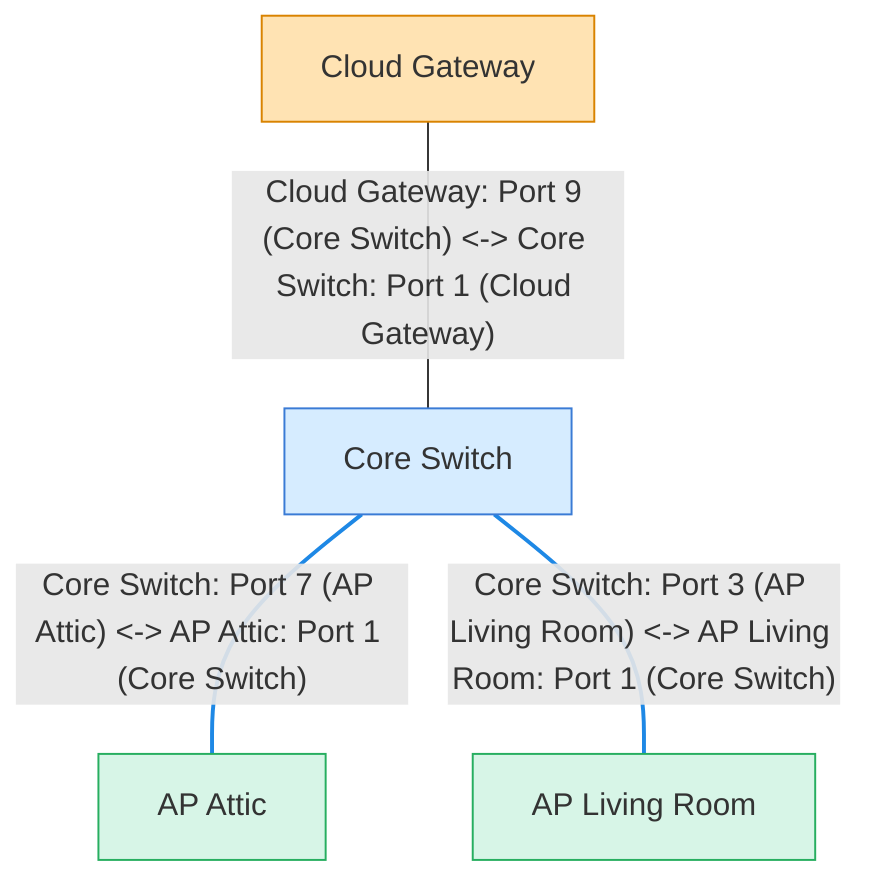

# unifi-network-maps

[](https://github.com/merlijntishauser/unifi-network-maps/actions/workflows/ci.yml)
[](https://github.com/merlijntishauser/unifi-network-maps/actions/workflows/codeql.yml)
[](https://github.com/merlijntishauser/unifi-network-maps/actions/workflows/publish.yml)
[](https://pypi.org/project/unifi-network-maps/)

CLI tool for generating UniFi network maps from LLDP topology. Outputs Mermaid, SVG (including isometric), Markdown, and MkDocs formats. Built on the [unifi-topology](https://pypi.org/project/unifi-topology/) library for topology modeling and SVG rendering.

Python 3.12+ is supported (3.13 preferred).

## Installation

PyPI:

```bash
pip install unifi-network-maps
```

From source:

```bash
python -m venv .venv
source .venv/bin/activate
pip install -r requirements-build.txt
pip install .
```

## Configuration

Set environment variables (no secrets in code). The CLI loads `.env` automatically if present:

```bash
export UNIFI_URL=https://192.168.1.1
export UNIFI_SITE=default
export UNIFI_USER=local_admin
export UNIFI_PASS=********
export UNIFI_VERIFY_SSL=false
export UNIFI_REQUEST_TIMEOUT_SECONDS=10
```

Use a custom env file:

```bash
unifi-network-maps --env-file ./site.env --stdout
```

## Quickstart

Basic map (tree layout by LLDP hops):

```bash
unifi-network-maps --stdout
```

Write Markdown for notes tools:

```bash
unifi-network-maps --markdown --output ./network.md
```

## Usage

Show ports + clients:

```bash
unifi-network-maps --include-ports --include-clients --stdout
```

SVG output (orthogonal layout + icons):

```bash
unifi-network-maps --format svg --output ./network.svg
```

Isometric SVG output:

```bash
unifi-network-maps --format svg-iso --output ./network.svg
```

MkDocs output (ports included, no clients):

```bash
unifi-network-maps --format mkdocs --output ./docs/unifi-network.md
```

MkDocs output with clients:

```bash
unifi-network-maps --format mkdocs --include-clients --output ./docs/unifi-network.md
```

MkDocs output with dual Mermaid blocks for Material theme switching:

```bash
unifi-network-maps --format mkdocs --mkdocs-dual-theme --output ./docs/unifi-network.md
```

LLDP tables for troubleshooting:

```bash
unifi-network-maps --format lldp-md --output ./lldp.md
```

Legend only:

```bash
unifi-network-maps --legend-only --stdout
```

JSON payload (devices + clients + VLAN inventory):

```bash
unifi-network-maps --format json --output ./payload.json
```

## Home Assistant integration

The live Home Assistant integration (Config Flow + coordinator + custom card) lives in a separate repo:
- https://github.com/merlijntishauser/unifi-network-maps-ha

## Programmatic API

The topology model, diff engine, snapshot serialization, and SVG renderer live in the
[unifi-topology](https://pypi.org/project/unifi-topology/) library. Use it directly for
programmatic access:

```python
from unifi_topology.model.topology import Topology
from unifi_topology.render import render_svg
```

See the [unifi-topology documentation](https://github.com/merlijntishauser/unifi-topology)
for the full API.

## Examples (mock data)

These examples are generated from `examples/mock_data.json` (safe, anonymized fixture).
Mock generation requires dev dependencies (`pip install -r requirements-dev.txt -c constraints.txt`).
Regenerate the fixture + SVG with `make mock-data`.

Generate mock data (dev-only, uses Faker):

```bash
unifi-network-maps --generate-mock examples/mock_data.json --mock-seed 1337
```

Generate the isometric SVG:

```bash
unifi-network-maps --mock-data examples/mock_data.json   --include-ports --include-clients --format svg-iso   --output examples/output/network_ports_clients_iso.svg
```



### Themes & Icon Sets

Built-in themes (`--theme`) and icon sets (`--icon-set`) can be combined freely.
Regenerate this overview with `make theme-matrix`.



Mermaid example with ports:



## MkDocs Material example

See `examples/mkdocs/` for a ready-to-use setup that renders Mermaid diagrams
with Material for MkDocs, including a sample `unifi-network` page and legend.


## Options

The CLI groups options by category (`Source`, `Functional`, `Mermaid`, `SVG`, `Output`, `Debug`).

Source:
- `--site`: override `UNIFI_SITE`.
- `--env-file`: load environment variables from a specific `.env` file.
- `--mock-data`: use mock data JSON instead of the UniFi API.

Mock:
- `--generate-mock`: write mock data JSON and exit.
- `--mock-seed`: seed for deterministic mock generation.
- `--mock-switches`: number of switches to generate (default 1).
- `--mock-aps`: number of access points to generate (default 2).
- `--mock-wired-clients`: number of wired clients to generate (default 2).
- `--mock-wireless-clients`: number of wireless clients to generate (default 2).

Functional:
- `--include-ports`: show port labels (Mermaid shows both ends; SVG shows compact labels).
- `--include-clients`: add active clients as leaf nodes.
- `--client-scope wired|wireless|all`: which client types to include (default wired).
- `--collapse-clients`: group clients by uplink device into cluster nodes with count badges.
- `--only-unifi`: only include neighbors that are UniFi devices; when clients are included, filters to UniFi-managed clients.
- `--no-cache`: disable UniFi API cache reads and writes.
- `--resolve-hostnames` / `--no-resolve-hostnames`: resolve device IPs to hostnames via reverse DNS against the controller (default: on for mkdocs, off otherwise).

Mermaid:
- `--direction LR|TB`: diagram direction (default TB).
- `--group-by-type`: group nodes by gateway/switch/AP in subgraphs.
- `--legend-scale`: scale legend font/link sizes (default 1.0).
- `--legend-style auto|compact|diagram`: legend rendering mode (auto uses compact for mkdocs).
- `--legend-only`: render just the legend as a separate Mermaid graph.

SVG:
- `--svg-width/--svg-height`: override SVG output dimensions.
- `--theme`: built-in theme (`unifi`, `unifi-dark`, `minimal`, `classic`, `classic-dark`).
- `--theme-file`: custom theme YAML (takes priority over `--theme`; see `examples/theme.yaml`).
- `--icon-set isometric|modern|unifi`: icon set to use (default: determined by theme, or `isometric`).
- `--svg-layout-mode physical|grouped|vlan`: layout mode for SVG output (default physical).
- `--iso-compact-layout`: for `svg-iso`, pack each hub and its clients into a compact district instead of spreading siblings along a single diagonal.
- `--iso-route-around-nodes`: for `svg-iso`, route edges around intervening nodes instead of always turning on the same axis.
- `--wan-label/--wan-speed`: WAN1 ISP name and provisioned speed.
- `--wan2-label/--wan2-speed`: WAN2 ISP name and provisioned speed.
- `--max-vlan-colors`: limit VLAN colors shown on edges (default: no limit).
- `--include-vlan-legend`: add VLAN color legend to SVG output.

Output:
- `--format mermaid|svg|svg-iso|lldp-md|mkdocs|json`: output format (default mermaid).
- `--stdout`: write output to stdout.
- `--output`: write output to file.
- `--markdown`: wrap Mermaid output in a code fence for notes tools like Obsidian.
- `--mkdocs-sidebar-legend`: write sidebar legend assets next to the output file.
- `--mkdocs-dual-theme`: render light/dark Mermaid blocks for Material theme switching.
- `--mkdocs-timestamp-zone`: timezone for mkdocs timestamp (default `Europe/Amsterdam`; use `off` to disable).

Debug:
- `--debug-dump`: dump gateway + sample devices to stderr for debugging.
- `--debug-sample N`: number of non-gateway devices in debug dump (default 2).

## Themes

Five built-in themes are available via `--theme`:

| Theme | Style | Default icon set |
|-------|-------|-----------------|
| `unifi` | Clean light theme based on the [ui.com](https://ui.com) color palette | modern |
| `unifi-dark` | Dark variant using official Ubiquiti dark surface colors | modern |
| `minimal` | Neutral grey tones, understated | isometric |
| `classic` | Warm default palette with distinct device colors | isometric |
| `classic-dark` | Dark variant of classic | modern |

For custom colors, create a theme YAML and pass it with `--theme-file`. Override only the values you need:

```yaml
mermaid:
  nodes:
    gateway:
      fill: "#ffe3b3"
      stroke: "#d98300"
  poe_link: "#1e88e5"
svg:
  icon_set: modern
  grid_color: "#c0c8d0"
  background: "#f9fafa"
  links:
    standard:
      from: "#006fff"
      to: "#0560d4"
  nodes:
    switch:
      from: "#4dd88a"
      to: "#38cc65"
```

See `examples/theme.yaml` and `examples/theme-dark.yaml` for full examples.

## Notes

- Default output is top-to-bottom (TB) and rendered as a hop-based tree from the gateway(s).
- Nodes are color-coded by type (gateway/switch/AP/client) with a sensible default palette.
- PoE links are annotated with a power icon when detected from `port_table`.
- Wireless client links render as dashed lines to indicate the last-known upstream.
- SVG port labels render inside child nodes for readability.
- Icon licenses and attribution are documented in [LICENSES.md](LICENSES.md).


## AI Disclosure

This project used Claude as a coding assistant for portions of the implementation and documentation.
